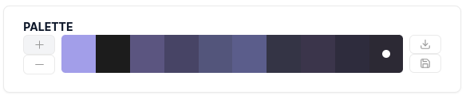

# Welcome!

This repo is the backend for [the `wordsofweb3.eth` glossary](https://wordsofweb3.eth.limo), from [Education DAO](https://educationdao.xyz/).

If the canonical URL isn't working, at `wordsofweb3.eth.limo`, try loading this IPNS hash: [https://ipfs.io/ipns/k51qzi5uqu5dik032y8x6pgcprlg8t42dy521tnnqiomgxauyt3u2z6j5x60r1/english-us/index.html](https://ipfs.io/ipns/k51qzi5uqu5dik032y8x6pgcprlg8t42dy521tnnqiomgxauyt3u2z6j5x60r1/english-us/index.html)

<!-- START doctoc generated TOC please keep comment here to allow auto update -->
<!-- DON'T EDIT THIS SECTION, INSTEAD RE-RUN doctoc TO UPDATE -->

**Table of Contents** _generated with [DocToc](https://github.com/thlorenz/doctoc)_

- [wordsofweb3](#wordsofweb3)
- [wordsofweb3: Architecture](#wordsofweb3-architecture)
  - [Design principles](#design-principles)
  - [Implementation implications](#implementation-implications)
    - [Creating the homepages](#creating-the-homepages)
      - [The Navbar and language switching](#the-navbar-and-language-switching)
    - [Creating the glossary entries](#creating-the-glossary-entries)
      - [`ext-sync-terms.csv`:](#ext-sync-termscsv)
    - [`app-side-glossary.csv`](#app-side-glossarycsv)
    - [Moving the information from .json to HTML](#moving-the-information-from-json-to-html)
    - [Paths and slugs](#paths-and-slugs)
  - [Creating the connections between the `definitions`](#creating-the-connections-between-the-definitions)
    - [Matching](#matching)
- [Overall site / `build` directory structure](#overall-site--build-directory-structure)
  - [Navbar / top-level link structure](#navbar--top-level-link-structure)
- [Search](#search)
- [Build](#build)
  - [`build.js`](#buildjs)
- [Deployment](#deployment)

<!-- END doctoc generated TOC please keep comment here to allow auto update -->

# Contributions

wordsofweb3 is meant to be a place where we all, collectively, can create a `credibly neutral`, living record of _what words mean_. The hope is that if we can agree on some definitions, we can begin to agree on reality a little bit more.

**Would you like to contribute**? Is a word's definition wrong? Should the term be in camel case? Have we failed to document a very important concept??

CORRECTIONS ARE THE WAY WE MAKE THIS GOOD.

## For the moment, please feel free to [create an issue in this repo](https://github.com/mapachurro/wordsofweb3/issues).

We are working on creating an attestation-based contribution flow / frontend for the app. Stay tuned!

# wordsofweb3: Architecture

wordsofweb3 is a multilingual glossary app encompassing terms and explanations about crypto, web3, and decentralized web, in general, terms, concepts, and entities.

It is meant to be an intertextual experience for the reader: in every `term`'s definition, whenever there is a term or phrase that is _also_ a `term` in the glossary in that language, there will be a hyperlink to that term.
Ideally, there will be a `breadcrumbs` element at the top of each entry page, tracking the user's journey through the interwoven terminology of this space.

## Design principles

This app is meant to be _for the ages_. The idea is that it _will never break_. It is designed to be deployed on decentralized storage networks, such as IPFS, which sometimes experience high latency; additionally, this technology should be accessible by the widest possible audience.

For these reasons, at every point at which we can choose "how to do X", we should choose the dumbest, most low-tech way possible.

This means that if you're installing an npm package, or importing a CDN, you might be doing it wrong.

### Conventions

We use ES Module syntax in wordsofweb3, so make sure any functionality uses this design paradigm. Additionally, please add graceful failures and error handling, and console logging, in any scripts you build or modify!

## Implementation implications

Yes, this means custom scripting; but anyone that tells you that an npm package or open source project will require _less_ maintenance than custom scripts that do what you want, well, wish them the best of luck with that.

### Homepages

As a fully internationalized app, the site will actually have multiple potential versions of its homepage.

This means there is an `index.html` page in the root directory `./`, as well as an index.html page in each of the locale directories, e.g. `./nederlands/index.html`.

The root index file, upon load, _should_ detect the user's browser locale, and direct them to the correct `./<locale>/index.html` file.
If there doesn't seem to be an appropriate locale for the user, the root index file should show a welcome message, display all available locales and allow the user to choose one.

These homepages are created by `build-homepages.js`, which runs during the build process.
This script ingests `index-template.html`, and applies UI translation strings found in `./l10n/<four-letter-dash-locale-code>/translation.json` to the elements that need to contain human-readable information.

#### The Navbar and language switching

The language dropdown selector on this site is much dumber than many that are out there.

Currently, **it only does one thing: takes you to the homepage of whatever language you select.**

Ideally, it would also switch between languages for the term page you're on.

### Creating the glossary entries

Similarly to the "template" format of the homepage, each `term`'s `entry page` will be generated **on the build side of the app; nothing will be created "generatively" on the reader's side.**

We currently are bringing new terms into the glossary though a kind of rough pipeline, housed in [./utils/data/import](./utils/data/import), using CSV files, which are more human-readable, to manage and update the content, then process into .json formatted for the rest of the site generation pipeline.

There are two CSV files we use in particular, `all-terms.csv`, and `english-terms.csv`. `all-terms` is the **canonical source of truth for what terms are in the glossary, and what their equivalents are across languages**.

To emphasize the importance of this: **The .json files that are created from this spreadsheet use the English term as the "object key" for that term in each additional language. This allows for functionality such as establishing equivalents across languages, obviously crucial for the project. *the structure of the .json created from this spreadsheet, therefore, must be the same across all languages*, and is a common source of issues, e.g. "why are there no terms loading in X language"**

`english-terms.csv` is imported because the author(s) of this glossary primarily work in English, and are updating definitions in English. 

**This process, overall, should be changed to be language-agnostic.**

**An alternate "term key" system which does not place English as the canonical "source of truth" would be in line with the spirit of this project. Currently, that is a "nice to have". If it becomes a "must do", that's a good problem to have, because it will mean this project is very successful.

More details about these files: 

#### `all-terms.csv`:

This .csv file is something that will be imported, from time to time, with new or updated terms in one or more languages.
It currently houses a large number of locales; here is a sample of its structure and content:

```CSV
Term [en-US],Term [ar],Term [zh-CN],Term [zh-TW],Term [nl-NL],Term [fr],Term [de-DE],Term [el-GR],Term [ha-NG],Term [hi-IN],Term [hu-HU],Term [id-ID],Term [it-IT],Term [ja-JP],Term [ko-KR],Term [fa-AF],Term [ms-MY],Term [pcm],Term [pl-PL],Term [pt-BR],Term [ro-RO],Term [ru-RU],Term [es-419],Term [tl],Term [th-TH],Term [tr-TR],Term [uk-UA],Term [vi-VN],Term [en-GB]
0x API,0x API,0x API,0x API,0x API,0x API,0x API,0x API,0x API,0x API,0x API,0x API,0x API,0x API,0x API,0x API,0x API,0x API,0x API,0x API,0x API,0x API,0x API,0x API,0x API,0x API,0x API,0x API,0x API
1inch,1inch,1inch,1inch,1inch,1inch,1inch,1inch,1inch,1inch,1inch,1inch,1inch,1inch,1inch,1inch,1inch,1inch,1inch,1inch,1inch,1inch,1inch,1inch,1inch,1inch,1inch,1inch,1inch
2FA,المصادقة الثنائية (2FA),双因素验证（2FA）,雙重要素驗證 (2FA),verificatie in twee stappen,Authentification double,2FA,Επαλήθευση δύο παραγόντων,Tabbatarwa ta Biyu,टू-फैक्टर ऑथेंटिकेशन,Kétlépcsős hitelesítés,2FA,Autenticazione a due fattori,2FA,2단계 인증,2FA,2FA,Double verification for security,2FA,2FA,2FA,двухфакторная аутентификация,autenticación de dos factores,2FA,การพิสูจน์ตัวจริงสองปัจจัย,İki Faktörlü Kimlik Doğrulaması,Двофакторна аутентифікація,2FA,2FA
3Box Labs,3Box Labs,3Box Labs,3Box Labs,3Box Labs,3Box Labs,3Box Labs,3Box Labs,3Box Labs,3Box Labs,3Box Labs,3Box Labs,3Box Labs,3Box Labs,3Box Labs,3Box Labs,3Box Labs,3Box Labs,3Box Labs,3Box Labs,3Box Labs,3Box Labs,3Box Labs,3Box Labs,3Box Labs,3Box Labs,3Box Labs,3Box Labs,3Box Labs
51% attack,هجوم 51٪,51%攻击,51%攻擊,51%-aanval,attaque des 51 %,51 % attacke,επίθεση του 51%,tsarin 51%,51% अटैक,51%-os támadás,51% attack,attacco del 51%,51%攻撃,51% 공격,حمله ۵۱٪,serangan 51%,Chop oga network wey pass 50%,atak 51%,ataque de 51%,atac 51%,атака 51%,ataque de 51 %,51% pag-atake,การโจมตี 51%,%51 saldırısı,aтака 51%,tấn công 51%,51% attack
Aave,Aave,Aave,Aave,Aave,Aave,Aave,Aave,AAVE,Aave,Aave,Aave,Aave,Aave,Aave,Aave,Aave,Aave,Aave,Aave,Aave,Aave,Aave,Aave,Aave,Aave,Aave,Aave,Aave
account,حساب,账户,帳戶,account,compte,konto,λογαριασμός,asusu,अकाउंट,fiók,akun,account,アカウント,계정,حساب,akaun,akaunt,konto,conta,cont,счет,cuenta,account,บัญชี,hesap,oбліковий запис,tài khoản,account

```

This .csv will be processed by a script, [generate-json.js](./utils/generate-json.js). For each locale, this script:

- Iterates through `./locales/<locale-code>` directories
  - In each directory, it looks for a file, `./locales/<locale-code>/<locale-code>.json`
    - If that file exists, it iterates through the rows of `ext-sync-terms.csv`, ensuring that:
      - There is a `term` object for each row of that locale (each word in that language), and that
      - There are no duplicate terms, such that building an HTML file from it would result in multiple HTML files located at the same URL path / slug.
      - Additionally, when this script creates a new term, it uses the following structure:

```json
    "Ethereum": {
      "term": "Ethereum",
      "phonetic": "/ɪˈθiːriəm/",
      "partOfSpeech": "noun",
      "definition": "A public blockchain network and decentralized software platform upon which developers build and run applications. As it is a proper noun, it should always be capitalized.",
      "termCategory": "project or product",
      "source": "",
      "datefirstseen": ""
    },
```

This script will, essentially, only be updating the `term` field of each object.
The name of each overarching object will be the term from the `en_US` column, whereas the `term` key's value will be populated from the corresponding locale.
The `partOfSpeech` value has not been filled out for most terms in most languages, but should mirror that of the `en_US` locale, unless grammatically incorrect in that language.
The `termCategory` value should also mirror `en_US`, unless subsequently changed.
If there is no data to fill in a given value (e.g., "source"), it should be left blank at this point (`source: "",`).

For example:

```json
    "Ethereum": {
      "term": "حساب",
      "phonetic": "",
      "partOfSpeech": "noun",
      "definition": "",
      "termCategory": "project or product",
      "source": "",
      "datefirstseen": ""
    },
```

### `english-terms.csv`

This file, like `all-terms`, will be imported from time to time, and will include updated English terms and their definitions.


### `app-side-glossary.csv`

`TODO`

We need a way to export this information, and manage it, in .csv format, for less-technical people who don't want to handle .json files.
For this reason, these collective .json files from each locale will be exportable, via a script not yet written, to `./utils/data/export/app-side-glossary.csv`, for exportation to e.g. Google Sheets for editing and updates.

There is a placeholder script, in [`./utils/data/export/TODO.js`](./utils/data/export/TODO.js), with more specifications.


Here is a sample of how [the current CSV file](./utils/data/import/all-terms.csv) looks:

```CSV

Term,Part of speech,Term Category,Phonetic,Definition,Source,Date first recorded
0x API,noun,project or product,/ˌzɪroʊ ˈɛks ˈeɪ.pi.aɪ/,"The 0x API is the liquidity and data endpoint for DeFi. It lets you access aggregated liquidity from tens of on-chain and off-chain decentralized exchange networks, across multiple blockchains. It comes with many parameters to customize your requests for your application and your users.",,
1inch,noun,project or product,/ˈwʌn ɪntʃ/,Decentralized exchange aggregator that aims to provide traders with the best price and lowest fees on their transactions.,,
2FA,noun,software term,"/ˈtuː ˈfæktər ɔːˈθɛntɪˌkeɪʃən/, /ˈtuː ˈɛf ˈeɪ/",Abbreviation; two-factor authentication (2FA) is an identity and access management security method that requires two forms of identification to access resources and data. 2FA gives businesses the ability to monitor and help safeguard their most vulnerable information and networks.See also 'U2F' When 2FA A,,
3Box Labs,noun,project or product,/ˈθriː bɑks ˈlæbz/,"The inventors and core developers of Ceramic, the first decentralized network for composable data. Ceramic makes it possible for developers to build data-rich Web3 applications without needing a traditional database, and in the process, unlocks data composability and portability across every application within the Web3 ecosystem",,
51% attack,noun,decentralized web,/ˈfɪfti wʌn pərˈsɛnt əˈtæk/,"If more than half the computer power or mining hash rate on a network is run by a single person or a single group of people, then a 51% attack is in operation. This means that this entity has full control of the network and can negatively affect a cryptocurrency by taking over mining operations, stopping or changing transactions, and double-spending coins.",,

```

### Moving the information from .json to HTML

Once this information is in its .json files in corresponding locale folders, we can proceed to generate the site's content from it.

`./utils/build-pages.js` does the following:

- Ingests `template.html`
- Looks up the list of terms in each language, in `./locales/<four-letter-dash-locale-code>/<four-letter-dash-locale-code>.json`
  - Iterates through that .json file, and for each `term` object,
    - Creates an .HTML file, filling in the placeholders in the HTML template with the values found in the object.

The script then should save that HTML file (e.g. `cuenta.html`) in a directory which it will create (and overwrite the contents of if it already exists, to ensure the most up to date build / version) if it doesn't already exist.

The script should save these **static HTML files** to:

`./static/<language-slug>/<term-in-that-language>.html`

There is a cross-locale mapping function present in this script, which should link a term entry in one language to its equivalent in every other in which it exists, by using the `object key` from the .json file, which should be the same for every term across all languages. It produces something like this:

```markdown
### Read this entry in:

[Spanish](./path-to-entry-in-Spanish.html)
[English](./path-to-entry-in-English.html)
```

### Paths and slugs

wordsofweb3 should always prioritize human-readability over concessions to the conventions of machines, even when that sucks for technical reasons.

An example of this: we do not have paths like `/es-419/cuenta.html`; no, we have `/nederlands/ethereum.html`. This does mean that, at times, we have to leverage functions available in the `l10n.js` script to convert between different formats of language codes. This script leverages a .json file which contains several different formats, at `./l10n/language-codes.json`:

```json
{
  "ar-001": {
      "name": "العربية",
      "slug": "العربية",
      "fourLetterDash": "ar-001",
      "fourLetterUnderscore": "ar_001",
      "twoLetter": "ar",
      "threeLetter": "ara",
      "notes": "As of 2024, we have limited Arabic dialectical differentiation, so preference is to use generic code"
  },
  "zh-CN": {
      "name": "中文-(简体)",
      "slug": "中文-简体",
      "fourLetterDash": "zh-CN",
      "fourLetterUnderscore": "zh_CN",
      "twoLetter": "zh",
      "threeLetter": "zho",
      "notes": "The alternative is to use zh-Hans and zh-Hant - which would delineate Simplified vs. Traditional without any regional association. I think for now we can stick with zh-CN and zh-TW, and perhaps expand to zh-HK if we need to."
     
  },
```

...and so on.

## Creating the connections between the `definitions`

Subsequent to the creation of the entry pages in `build-pages.js`, a second script is run (when invoked using `npm run build` and the `build.js` script): `./utils/intertextual.js` does the following:

- Ingest the corresponding `./locales/<four-letter-dash-locale-code>/<four-letter-dash-locale-code>.json` file
- Iterate over the built files for that locale in `./static/<locale-slug>/*`
- In each HTML file within that directory, locate the `<p id="description">` tag which will have been created by `build-pages.js`
- Search for terms or phrases which [match](#matching) a `term` key in the .json file
- For each match, create a hyperlink to that term, following the pattern `./<term-key>.html`. Given that all the .html files will be in the same directory, this should provide for easy resolution. **terms will not be indexed across languages**.

This script should have robust console logging and graceful error handling, given the number of edge cases it will present.
It should save this output to file at `./utils/intertextual-output-<number>.txt`, increasing the number each time so that subsequent versions of the log can be checked.

### Matching

There is a difficult implementation detail here: `stop words`, `stems`, and `plurals`.

A quality contextual search will use detailed information about the morphology of a given language to find a _good_ match, not just something that happens to match a pattern.
One option is to leverage [lunr-languages](https://github.com/MihaiValentin/lunr-languages), which has a decent and open source (MPL) collection of such files.

# Overall site / `build` directory structure

```bash
./build (once build.js has been run (npm run build))
    index.html
    ./js
        search.js
        navbar.js
        index.js
        l10n.js
        explore.js
    ./assets
        <locale-code>-index.json` x number of locales
    ./css
        styles.css
    ./images
        `any images needed by the app`
    favicon.ico
    ./en-US
        directoryContents.json
        51%-attack.html
        account.html
            etc.
    ./es-ES
        directoryContents.json
        ataque-del-51%.html
        cuenta.html
        ...etc
```

## Navbar / top-level link structure

As stated, upon changing the language using the dropdown selector (or the URL bar), you go to the corresponding index.html page.

This should also change _the search index used for any searches made_, such that if I have selected Nigerian Pidgin, I am searching the index of Nigerian Pidgin terms.

# Search

The search will be key functionality in this site.

The current implementation leverages the directoryContents.json files, which are generated during build. It currently matches any terms which have the search query term in them. Ideally, we have something like this in the future:

```markdown

# Additional pages

The first additional page, outside the core Glossary, is the `Resources` page. 

This is a static page, mostly of links. It will have two sections, to begin with: 

1. Web3, Decentralized Web, and Crypto Glossaries and Explainers

This section simply lists glossaries and **conceptual explainers** in this technological area. It does **not** list *educational resources*, such as courses or bootcamps.

2. High-Value Source Materials

This section lists websites, forums, GitHub repositories, etc., where reliable information about terminology can be sourced. This includes places like the Ethereum Cat Herders and Magicians' sites, the Bitcoin Wiki, ethereum.org, etc. 

**For the time being, if you'd like to add something to this list, open an issue or a PR on this repo!**

`TODO :`
- When the submission flow is created, allow users to submit suggestions here

## Term matches

- Terms that have the search query in them

## Definition matches

- Terms that have the search query in their `description` field

## Partial matches

- Terms that partially match the search query
```

In this way, the reader will be presented with the most relevant searches first.

# Front end, imagery, colors, and overall `vibes`

## Hex codes for Education DAO palette, in order from left to right in this screenshot:



- #a49ceb
- #1c1c1c
- #5c5481 
- #484366
- #54547c 
- #5c5c8c
- #343446
- #3c344c
- #2e2c3d
- #2c2934

# Build

There is a distinction made in this repo between the JS files in `./src/js`, and `./utils`:

./src/js: client-facing javascript, ie, things that run "in the site", such as the Search function that happens when you click the "search" button

vs

./utils: javascript intended for the build process, ie, things that run "to build the site", such as `build-search-indices.js`, which creates the static search index files.

For this reason, `build.js` is located in `utils`, and should only ever copy over to `./build/js/*` the JS files in `./src.js`.

## `build.js`

This script is invoked by `npm run build`, and will, in turn:

- Build the homepages, with `build-homepages.js`
- Build the individual entry pages, with `build-pages.js`
- Run `intertextual.js`
- Create the `directoryContents.json` files
- Copy over the following directories and files:

```txt
./l10n  (recursively) to ./build/l10n
./public/assets/css to ./build/css
./public/assets/<files at this level> to ./build/assets
./public/assets/search-indices (recursively) to ./build/search-indices
./static/<languageName directories>/* to ./build/* (so, all files within ./static/deutsche, and all its contents, should be copied to ./build/deutsche)
index.html to ./build/index.html
index.js to ./build/index.js
```

# Deployment

This site is deployed on IPFS, for starters, using Fleek.xyz. It can and probably should be deployed on other decentralized storage networks.

The intention is to route the ENS name `wordsofweb3.eth` to an IPNS hash using Fleek.xyz, such that it could be accessed at `wordsofweb3.eth.limo`, etc.
